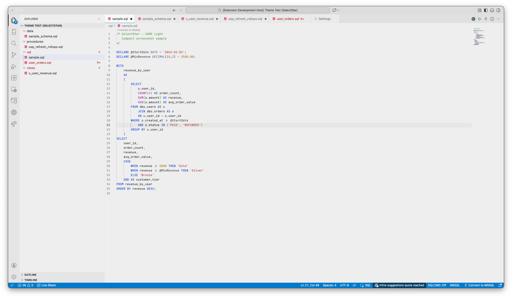
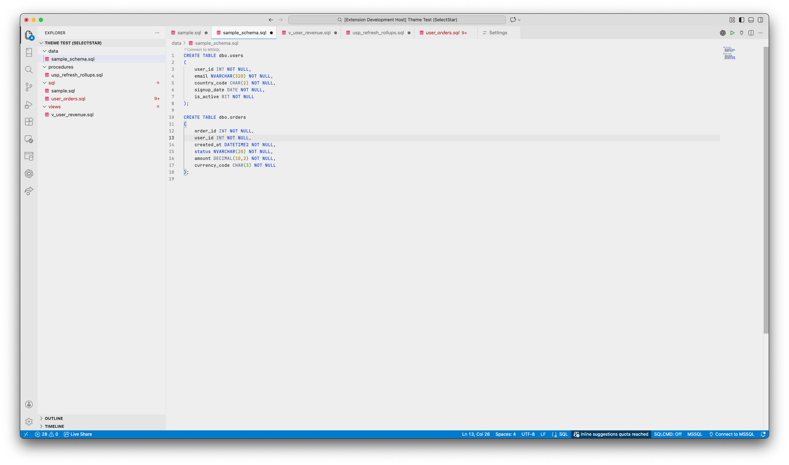
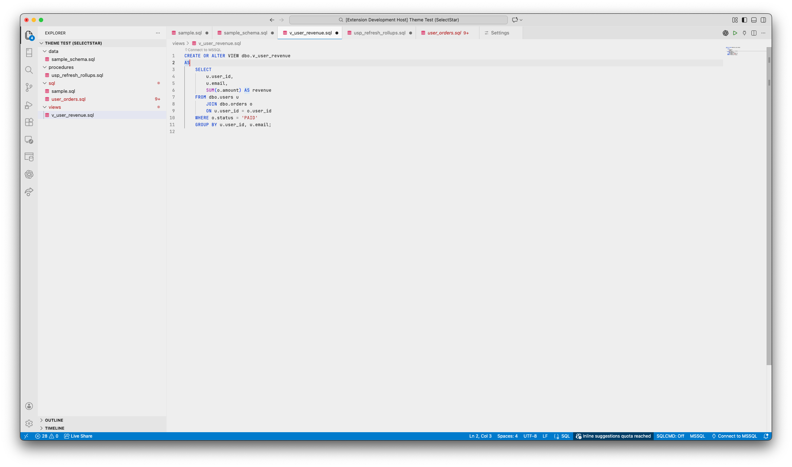
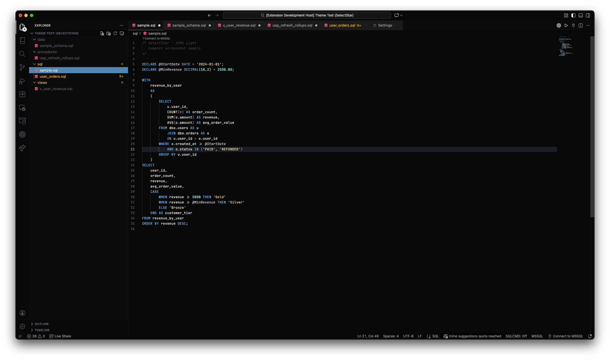
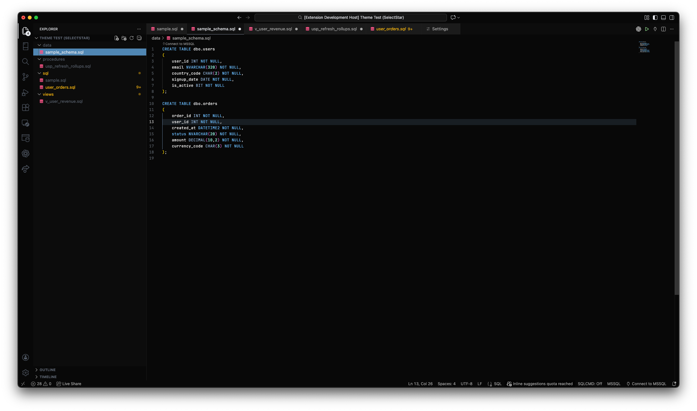
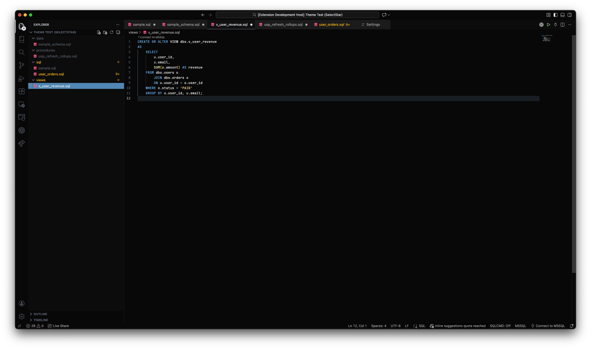
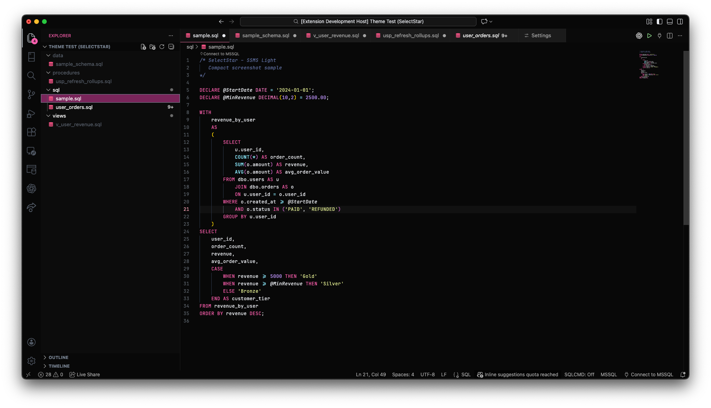
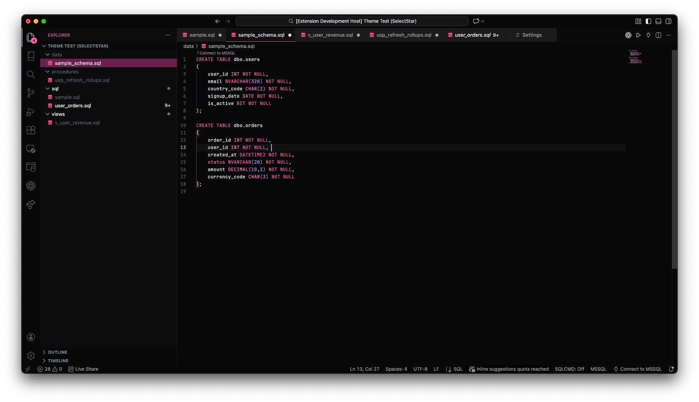
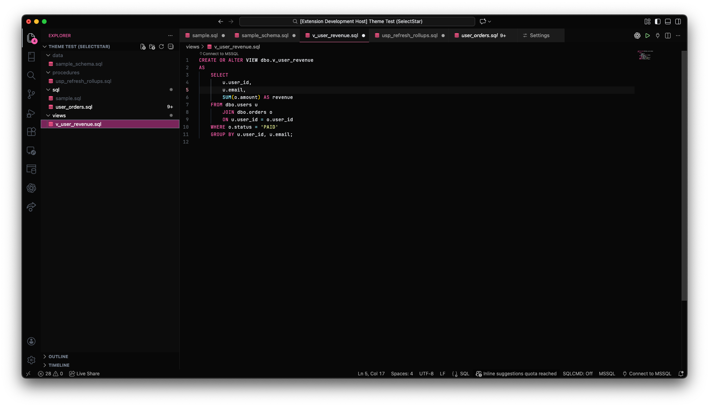

# SelectStar

SelectStar is a clean, familiar VS Code theme collection optimised for SQL readability and data-heavy workflows.

It focuses on calm UI colours, clear hierarchy and restrained accents inspired by tools such as SSMS.

## Variants

- **SelectStar – SSMS Light**  
  A light theme inspired by SQL Server Management Studio, with a bright editor surface, classic syntax colours, and clear blue focus states.

- **SelectStar – Dark**  
  A soft, low-contrast dark theme designed for long SQL sessions.

- **SelectStar – Dark (Pink Star)**  
  The same dark foundation with a warmer pink accent.

## Usage

Open the Command Palette and select **Preferences: Color Theme**,  
then choose your preferred SelectStar variant.

## Installation

1. Install **SelectStar** from the VS Code Marketplace
2. Open **Preferences → Color Theme**
3. Select one of the SelectStar variants

## Designed for

- SQL and T-SQL
- dbt projects
- Data engineering and analytics workflows
- Long reading and querying sessions

## Recommended font

- **JetBrains Mono** (ligatures optional)

## Screenshots

### SelectStar – SSMS Light

### SelectStar – Dark

### SelectStar – Dark (Pink Star)

