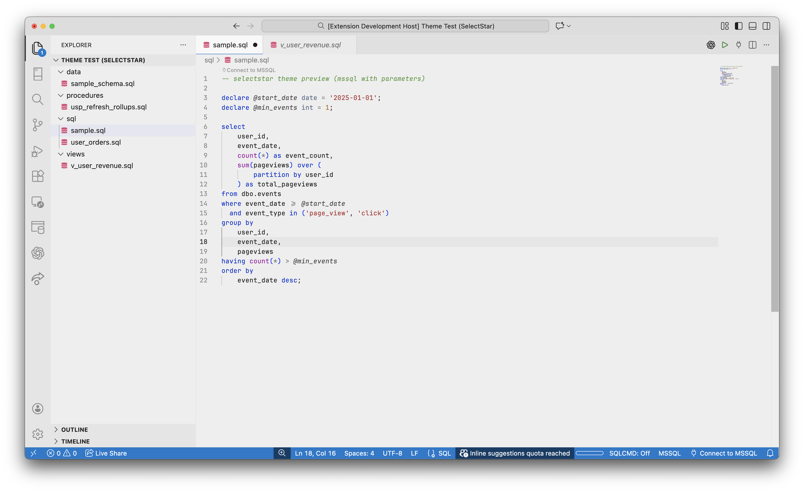
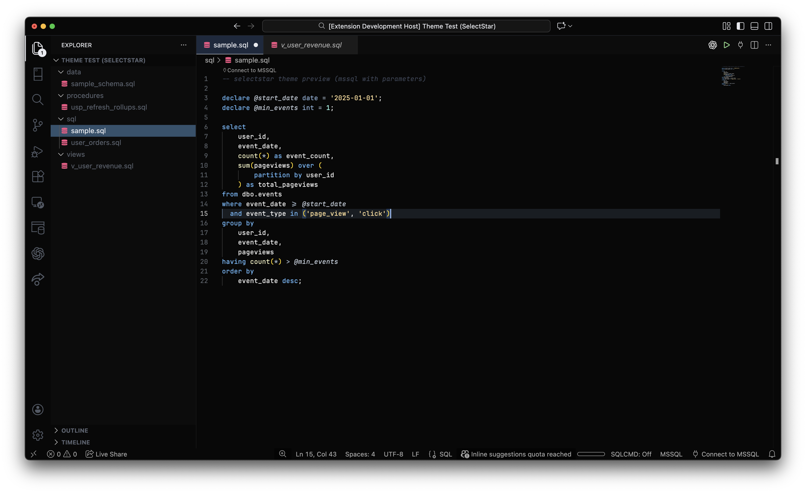
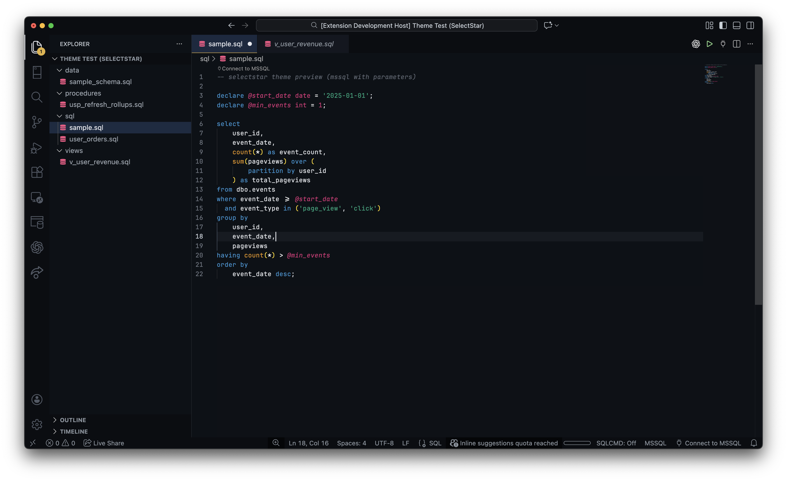
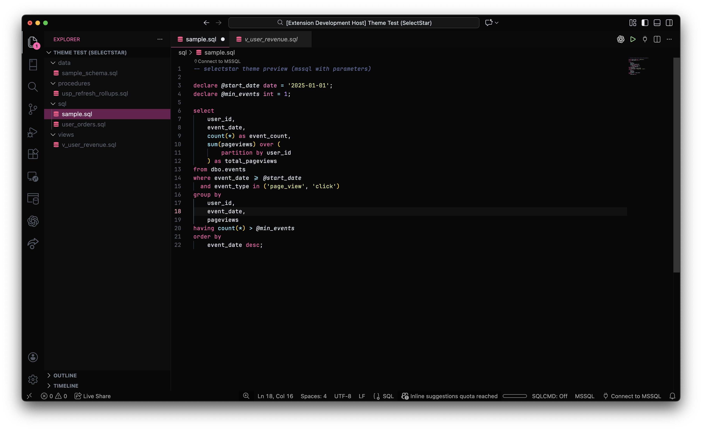

# SelectStar

SelectStar is a focused VS Code theme collection designed for **SQL readability** and **data-heavy workflows**.

It prioritises calm surfaces, clear hierarchy and restrained accents, with visual cues inspired by familiar tools such as **SSMS**, while feeling at home in modern editors.

The goal is simple: reduce visual noise so you can read, reason and query for long sessions without fatigue.

---

## Variants

- **SelectStar – SSMS Light**  
  A light theme inspired by SQL Server Management Studio, with a bright editor surface, classic syntax colours and clear blue focus states.

- **SelectStar – Dark**  
  A soft, low-contrast dark theme designed for long SQL sessions, with muted highlights and minimal distractions.

- **SelectStar – Dark (Pink Star)**  
  The same dark foundation with a warmer pink accent for visual distinction.

- **SelectStar – Code Block**  
  A darker, more structured variant optimised for dense code blocks and side-by-side querying. Emphasises strong hierarchy, controlled blues for navigation and subtle amber accents for focus and change.

---

## Usage

Open the Command Palette and select **Preferences: Color Theme**,  
then choose your preferred **SelectStar** variant.

---

## Installation

1. Install **SelectStar** from the VS Code Marketplace  
2. Open **Preferences → Color Theme**  
3. Select one of the SelectStar themes

---

## Designed for

- SQL and T-SQL
- MSSQL and SSMS-style workflows
- dbt projects
- Data engineering and analytics
- Long reading, querying and debugging sessions

---

## Design principles

- Calm, neutral editor surfaces  
- Clear separation between editor, chrome and controls  
- Blue for navigation and selection  
- Amber for attention and modification  
- Red reserved strictly for errors  
- Minimal use of colour for maximum clarity  

---

## Recommended font

- **JetBrains Mono** (ligatures optional)

---

## Screenshots

### SelectStar – SSMS Light
  

### SelectStar – Dark
  

### SelectStar – Code Block

### SelectStar – Dark (Pink Star)
  
